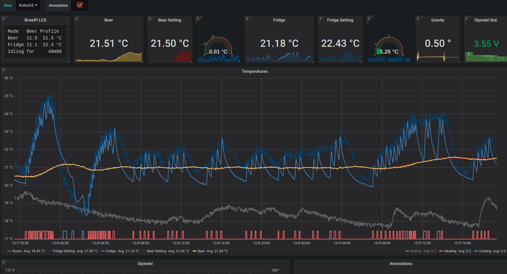

# BrewMon: The Brew Dashboard

## About

BrewMon provides a customisable dashboard for beer fermentation with alerting support.

The fermentation metrics are coming from multiple sources, the first target is to support:

- [BrewPI](https://www.brewpi.com/) a great fermentation temperature controller that reports:
  - the wort (aka beer) temperature
  - the fermentation chamber (aka fridge) temperature
  - the room temperature
  - the beer setting temperature: the target temperature chosen by the brew master
  - the fridge setting temperature: the target temperature chosen by BrewPi to reach the beer setting
  - the state of the controller: cooling, heating, idling ...
  - Annotations when changing the beer setting or profile  

- [iSpindel](http://www.ispindel.de/) an amazing hydrometer that reports:
  - the wort gravity
  - the temperature of the wort
  - its battery level

This project is under active development.

## First screenshots

Here the first screenshots of the BrewMon dashboard just few minute after soldering the iSpindel (the device is not yet calibrated
nor in the fermenter).




An example of dashboard snapshot:

https://snapshot.raintank.io/dashboard/snapshot/Klzhv0csYbH4S39miAYi9Mi2H0yG4ERA


## Architecture

The solution relies on [Grafana](https://grafana.com/) for the dashboard and [InfluxDB](https://www.influxdata.com/time-series-platform/influxdb/) as metric storage. 

BrewPi is patched to report metrics to InfluxDB in real time.

iSpindel is configured to report metrics to InfluxDB (supported since firmware 5.x). 

BrewMon provides a script to import existing BrewPi beer (from CSV format).


## Installation

### On RaspberryPi

One line installation on the Raspberry Pi running BrewPi in legacy version:
```bash
bash <(curl -Ss https://raw.githubusercontent.com/bdelbosc/brewmon/master/scripts/bm-install.sh)
```

This script will:
- install Debian packages for InfluxDB and Grafana, along with the BrewMon dashboard
- install the brewmon python package
- patch BrewPi script to report metrics into InfluxDB

### On amd64 architecture

Install [docker compose](https://docs.docker.com/compose/):
```bash
sudo -s
curl -fsSL get.docker.com -o get-docker.sh && sh get-docker.sh
pip install docker-compose
```

Then:
```
git clone https://github.com/bdelbosc/brewmon.git
cd brewmon/etc
docker-compose up -d
```

## Usage

### Grafana dashboard

Grafana starts with a provisioned InfluxDB source and BrewMon dashboard.

Grafana is accessible on port 3000 of your BrewPi [http://brewpi:3000/](http://brewpi:3000/) 
the initial login / passord is admin/admin.

The provisioned dashboard is named "BrewMon Template" and is read only, you need to create a copy if you want to change it.

Visit the [Getting started documentation](http://docs.grafana.org/guides/getting_started/) to learn more about Grafana. 

### Import existing BrewPi metrics

BrewPi saves beer metrics into CSV files under `/var/www/html/data/`.

To import a CSV file into InfluxDB use the `bm-import` script: 

```bash
# Import file into local influxdb http://localhost:8086/brewpi
bm-import /var/www/html/data/Kolsch/Kolsch.csv

# For more options
bm-import --help
```

## Limitations

For now BrewMon is only tested on:
- Raspberry Pi 3B+
- Raspian 9.6
- BrewPi legacy version, note that BrewPi need a [minor change to run on recent Raspian/PHP7](https://github.com/BrewPi/brewpi-www/compare/legacy...bdelbosc:legacy?expand=1).    
- iSpindel 6.0.2

## Development

### Rationales

Grafana and InfluxDB are light enough to run on the same RaspberryPi (RPI) used by BrewPi.

Grafana offers customisable dashboard with alerting capabilities, a dashboard and its content can be easily shared using [raintank.io](http://snapshot.raintank.io/info/) 
 
The storage is based on InfluxDB because:
- it is supported by iSpindel (not like Graphite)
- it is able to import existing data (not like Prometheus)
- it has an infinite retention by default (not like Graphite/Prometheus) 
- it supports the UDP protocol
- it has a very small resource footprint

InfluxDB can also be used for other metrics during mashing when using CraftBeer or simply to monitor the RPI OS.

BrewPi needs to be patched without creating any regression, for this reason the metrics are exported continuously using UDP.

Installation on Raspberry Pi relies on Debian package because at the moment there is no Grafana docker image for armhf.

### InfluxDB storage

The default database is named `brewmon` and there is one series per BrewPi beer and one series for iSpindel.

All date are stored in UTC, Grafana will manage your timezone.
 
From the RaspberryPi you can run [`influx`](https://docs.influxdata.com/influxdb/v1.7/tools/shell/) to get an interpreter, on docker just run

```bash
docker exec -it influxdb /usr/bin/influx
```

From there you can access the metrics:
```sql
-- Select the database and display timestamp as date
> USE brewmon
> precision rfc3339

-- List beers
> SHOW series
key
---
Kolsch,beer_name=Kolsch
measurements,source=iSpindel000

-- Show BrewPi annotation for a beer
> SELECT title FROM "Kolsch"
name: Kolsch
time                 title
----                 -----
2018-12-03T22:28:21Z Beer temp set to 18.7 in web interface
2018-12-04T10:20:12Z Beer temp set to 18.5 in web interface
2018-12-05T13:36:59Z Beer temp set to 19.0 in web interface

-- Delete some points, it requires time as nano second timestamp
> precision ns
> SELECT time, beer_temp FROM "Kolsch" WHERE beer_temp <= 18.0 and time > '2018-12-05'
name: Kolsch
time                beer_temp
----                ---------
1544007570000000000 15.93
1544007449000000000 17.33
1544007690000000000 17.85
> DELETE FROM "Kolsch" WHERE time = 1544007570000000000
> DELETE FROM "Kolsch" WHERE time = 1544007449000000000
> DELETE FROM "Kolsch" WHERE time = 1544007690000000000

-- Add an annotation using a timestamp in ns
> INSERT Kolsch,beer_name=Kolsch title="Some annotation" 1544007690000000000

-- Query the iSpindel data
> SELECT * FROM "measurements" WHERE time >= now() - 5m
name: measurements
time                           RSSI battery  gravity   interval source      temp_units temperature tilt
----                           ---- -------  -------   -------- ------      ---------- ----------- ----
2018-12-07T14:55:55.159109731Z -70  3.592284 2.844413  120      iSpindel000 C          20.4375     30.86859


-- Delete metrics related to a beer
DROP SERIES FROM "Kolsch"
```

## License

[GNU GENERAL PUBLIC LICENSE](https://www.gnu.org/licenses/gpl.txt)
