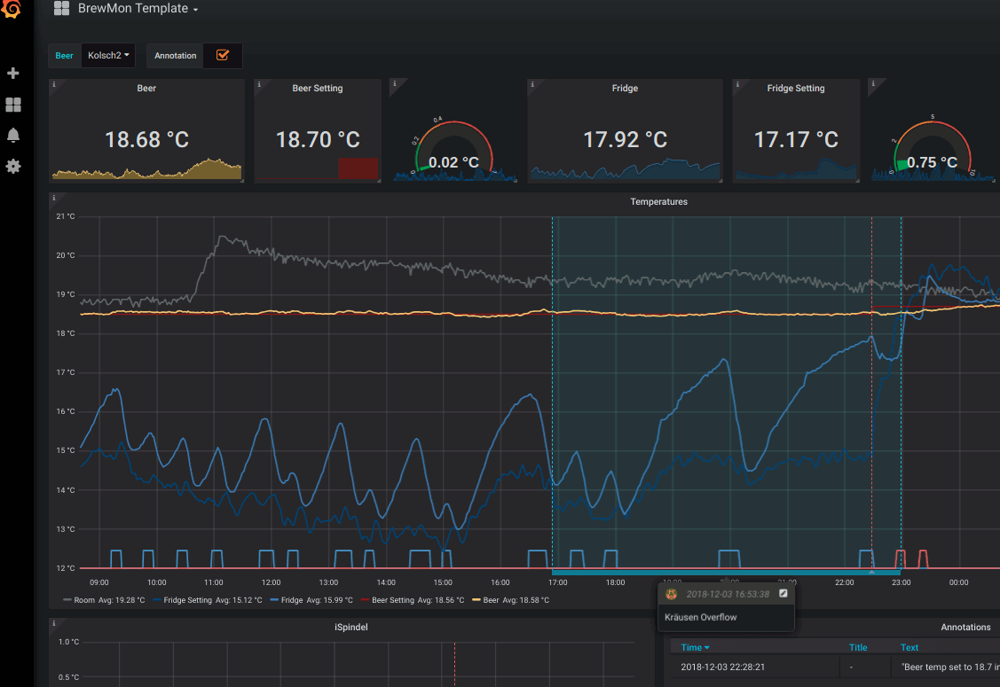
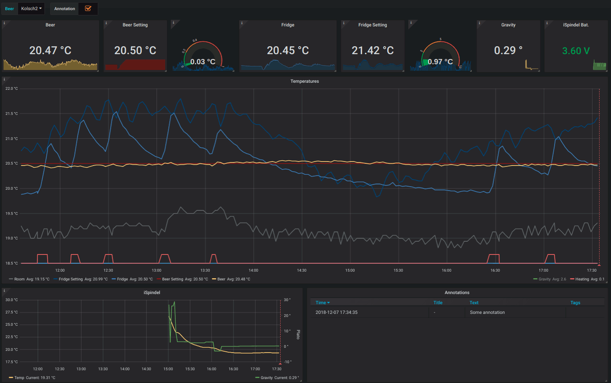

# BrewMon: The Brew Dashboard

## About

BrewMon aims to provide a customizable monitoring dashboard for beer fermentation.

The fermentation metrics are coming from multiple sources, the first target is to support:

- [BrewPI](https://www.brewpi.com/) a fermentation temperature controller that reports:
  - the wort (aka beer) temperature
  - the fermentation chamber (aka fridge) temperature
  - the room temperature
  - the beer setting temperature: the target temperature chosen by the brew master
  - the fridge setting temperature: the target temperature chosen by BrewPi to reach the beer setting
  - the state of the controller: cooling, heating, idling ...
  - Annotations when changing the beer setting or profile  

- [iSpindel](http://www.ispindel.de/) an hydrometer that reports:
  - the wort gravity
  - the temperature of the wort
  - its battery level

This project is under active development.

## Screenshots

Here are first screenshots of the BrewMon dashboard just few minute after soldering the iSpindel the device is not yet calibrated
and outside of the fermenter so don't expect valuable metrics on this first try.




https://snapshot.raintank.io/dashboard/snapshot/Klzhv0csYbH4S39miAYi9Mi2H0yG4ERA

  

## Architecture

The solution relies on [Grafana](https://grafana.com/) for the dashboard and [InfluxDB](https://www.influxdata.com/time-series-platform/influxdb/) as metric storage. 

BrewPi needs to be patched to be able to report metrics to InfluxDB.

iSpindel needs to be configured to report its metrics to InfluxDB (supported since firmware 5.x). 

BrewMon provides an importer to inject existing BrewPi beer in CSV format.


### Rationales

Grafana and InfluxDB are light enough to run on the same RaspberryPi (RPI) used by BrewPi.

Grafana offers customisable dashboard with alerting capabilities, a dashboard and its content can be easily shared using [public snapshot](http://snapshot.raintank.io/info/) 
 
The storage is based on InfluxDB because:
- it is supported by iSpindel (not like Graphite)
- it is able to import existing data (not like Prometheus)
- it has an infinite retention by default (not like Graphite/Prometheus) 
- it supports the UDP protocol
- it has a very small resource footprint

InfluxDB can also be used for other metrics during mashing when using CraftBeer or simply to monitor the RPI OS.

BrewPi needs to be patched to add the InfluxDB support but the change should never block BrewPi,
for this reason the metrics are exported continuously using UDP.

## Installation

### On RaspberryPi

At the moment the install relies on Debian packages instead of docker because there is no recent Grafana image that work on RaspberryPi (armhf architecture).

```bash
# install the python brewmon package
$ sudo pip install --no-binary :all: /tmp/brewmon-0.1.zip
# Run the installer 
$ bm-install
```

After this the Grafana and InfluxDB are automatically started and configured.

To receive the metrics in real time a file in BrewPi need to be patched, here is the change for the legacy version of BrewPi:
https://github.com/bdelbosc/brewpi-script/commit/8ae692e60f6f82d8658f774eef8406525d1b87c9

The default location for this file is:
/home/brewpi/brewpi.py


### On amd64 architecture

Install [docker compose](https://docs.docker.com/compose/):
```bash
sudo -s
curl -fsSL get.docker.com -o get-docker.sh && sh get-docker.sh
pip install docker-compose
```

Then:
```
git clone https://github.com/bdelbosc/brewmon.git
cd brewmon/etc
docker-compose up -d
```

## Usage

### Grafana

Grafana starts with a provisioned InfluxDB source and BrewMon dashboard.

Grafana is accessible on port 3000 of your BrewPi [http://brewpi:3000/](http://brewpi:3000/) 
the initial login / passord is admin/admin.


The provisioned dashboard is named "BrewMon Template" and is read only, you need to create a copy if you want to change it. 

### Import existing BrewPi metrics

BrewPi is saving its metrics into CSV files in `/var/www/html/data/`. There is a folder per beer with a CSV file containg all the BrewPi metrics.

To import such file into InfluxDB and therefore 

```bash
# Import file into local influxdb http://localhost:8086/brewpi
bm-import --beer-name Kolsh ./data/Kolsch2.csv

# For more options
bm-import --help
```

## Limitations

For now only tested on:
- Raspberry Pi 3B+
- BrewPi legacy version deployed on Raspian 9.6, to do this it requires [some minor change to run with PHP7](https://github.com/BrewPi/brewpi-www/compare/legacy...bdelbosc:legacy?expand=1).
- iSpindel 6.0.2 

## Development

### InfluxDB storage

The default database is named `brewmon` and there is one series per beer.

All date are stored in UTC, Grafana will manage your timezone.
 
From the RaspberryPi you can run [`influx`](https://docs.influxdata.com/influxdb/v1.7/tools/shell/) to get an interpreter, on docker just run

```bash
docker exec -it influxdb /usr/bin/influx
```

From there you can access the metrics:
```sql
-- Select the database and display timestamp as date
> USE brewmon
> precision rfc3339

-- List beers
> SHOW series
key
---
Kolsch,beer_name=Kolsch
 
-- Show BrewPi annotation for a beer
> SELECT title FROM "Kolsch"
name: Kolsch
time                 title
----                 -----
2018-12-03T22:28:21Z Beer temp set to 18.7 in web interface
2018-12-04T10:20:12Z Beer temp set to 18.5 in web interface
2018-12-05T13:36:59Z Beer temp set to 19.0 in web interface

-- Delete some points, it requires time as nano second timestamp
> precision ns
> SELECT time, beer_temp FROM "Kolsch" WHERE beer_temp <= 18.0 and time > '2018-12-05'
name: Kolsch
time                beer_temp
----                ---------
1544007570000000000 15.93
1544007449000000000 17.33
1544007690000000000 17.85
> DELETE FROM "Kolsch" WHERE time = 1544007570000000000
> DELETE FROM "Kolsch" WHERE time = 1544007449000000000
> DELETE FROM "Kolsch" WHERE time = 1544007690000000000

-- Add an annotation using a timestamp in ns
> INSERT Kolsch,beer_name=Kolsch title="Some annotation" 1544007690000000000

-- Query the iSpindel data
> SELECT * FROM "measurements" WHERE time >= now() - 1h LIMIT 1
name: measurements
time                           RSSI battery  gravity   interval source      temp_units temperature tilt
----                           ---- -------  -------   -------- ------      ---------- ----------- ----
2018-12-07T14:55:55.159109731Z -70  3.592284 2.844413  120      iSpindel000 C          20.4375     30.86859


-- Delete all points related to a beer
DROP SERIES FROM "Kolsch"
```


## License

[GNU GENERAL PUBLIC LICENSE](https://www.gnu.org/licenses/gpl.txt)
