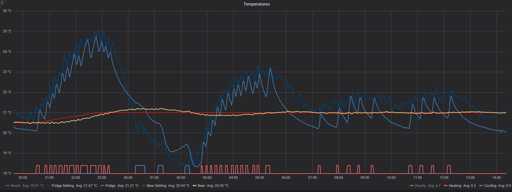

# BrewMon: The Brew Dashboard

## About

BrewMon is a solution for monitoring beer fermentation.

Because fermentation metrics come from different equipments there is a need to build a customizable dashboard
to follow the fermentation and be alerted in case of problem.

The first target is to support the following equipments:

- [BrewPI](https://www.brewpi.com/) a great temperature controller that can control the beer fermentation with 0.1°C precision.

  

- [iSpindel](http://www.ispindel.de/) an amazing DIY electronic hydrometer to get the wort gravity in real time.

  


This project is under active development.

## First screenshots

Here are the first screenshots of the BrewMon dashboard,  
the iSpindel is not yet calibrated nor in the fermentation bucket.

[](https://snapshot.raintank.io/dashboard/snapshot/xhw7C5p3SICux4A9Nklx6Aq4HTVjSGgM?orgId=2)


[](https://snapshot.raintank.io/dashboard/snapshot/1BR7lho8CFTyNc5RSOLy8m71b33kjfmc?orgId=2)


## How does it work ?

The solution relies on [Grafana](https://grafana.com/) which is a monitoring and alerting platform with customisable dashboards and annotations.

The metrics are stored in [InfluxDB](https://www.influxdata.com/time-series-platform/influxdb/), a time series database.

BrewPi is slightly modified to send its metrics to InfluxDB and extended to be able to import existing one.

iSpindel is configured to report metrics to InfluxDB.

The stack (BrewPi + InfluxDB + Grafana) is running on the Raspberry Pi using [docker-compose](https://docs.docker.com/compose/overview/).

## Installation

### On RaspberryPi

#### Install Raspbian Stretch Lite
  Follow the [BrewPi Guide](https://wiki.brewpi.com/getting-started/raspberry-pi-docker-install#install-raspbian)
  up to the ssh access.
   
  Rename the host from `raspberrypi` to `brewpi` by editing `/etc/hostname` and `/etc/hosts`, then restart.

#### Install the BrewMon stack

- ssh to the Raspberry Pi then:
```bash
bash <(curl -Ss https://raw.githubusercontent.com/bdelbosc/brewmon/master/bm-install.sh)
```

This one line installer will :
- install docker
- install docker-compose
- build docker images: influxdb, grafana, brewpi (it takes ~15 minutes)
- start the stack as a service named `brewmon`
- provision a "BrewMon Template" dashboard


The default docker volume that contains all the data is:
- `/home/pi/brewpi`
```bash
pi@brewpi:/home/pi/brewpi
  ├── data # the BrewPi data
  │   ├── data
  │   ├── html_data
  │   ├── logs
  │   └── settings
  ├── grafana
  └── influxdb
```

You can configure the USB device and volume location by editing the [`.env`](https://github.com/bdelbosc/brewpi-docker/blob/legacy/raspbian/.env) file


### On x86_64 architecture

The stack can be also deployed on a normal x86_64 architecture.

First install [docker and docker-compose](https://docs.docker.com/compose/):
```bash
curl -fsSL get.docker.com -o get-docker.sh && sh get-docker.sh
pip install docker-compose
```

Then checkout the docker compose files: 
```bash
git clone https://github.com/bdelbosc/brewpi-con.git
```

Build docker images:
```bash
cd brewpi-docker/ubuntu
docker-compose build
```

Run docker compose
```bash
docker-compose up -d
```

### Configuring iSpindel

Follow the iSpindel configuration:
- Connect the iSpindel to a computer and install the latest firmware (InfluxDB is supported since version 5.8.5)
- Press the Wemos reset button and connect to the iSpindel AP
- Configure your Wifi access
- Select the InfluxDB reporting
  - use the BrewPi IP (or the IP where InfluxDB is installed) and the port 8086
  - use `brewmon` database

TODO: Add some screenshot

## Usage

### Stop / Start stack

The stack can be start and stop using systemd:
```bash
sudo systemctl status brewmon.service
sudo systemctl stop brewmon.service
sudo systemctl start brewmon.service
```

### BrewPi

BrewPi should work exactly as expected in the **legacy** version, the default deployment use `nginx` configured 
with basic authentication, you can login using the `brewpi` account with the default `brewpi` password.

In the log `pi@brewpi:/home/pi/brewpi/data/logs/stderr.txt` you should have a message like:
```bash
 Dec 18 2018 18:03:26   Publish metrics to InfluxDB influxdb:4444/brewmon UDP
```

### Grafana dashboard

Grafana starts with a provisioned InfluxDB data source and the BrewMon dashboard.

Grafana is accessible on port 3000 of your BrewPi for instance: [http://brewpi:3000/](http://brewpi:3000/).

You can login using the `admin` account with the default `admin` password.

The provisioned dashboard is named "BrewMon Template".
You need to create a copy to be able to edit the dasboard,
this can be done using the top menu: Settings > Save As...

Visit the [Getting started documentation](http://docs.grafana.org/guides/getting_started/) to learn more about Grafana. 

### Import existing BrewPi beer metrics

BrewPi enable to export existing metrics "Maintenance Panel" > "Previous Beers" > "Select beer" > "Download CSV" 

This file can be imported into InfluxDB with the `bm-import.py` script present on the BrewPi container:

```bash
# Copy the CSV file to the RPI:
scp MyBeer.csv brewpi:/tmp/
# ssh to the RPI
ssh brewpi
# copy the file to a volume accessible by brewpi
sudo mv /tmp/MyBeer.csv /home/pi/brewpi/data/
# Import the file
sudo docker exec brewpi /home/brewpi/bm-import.py /data/MyBeer.csv
# Importing beer 'MyBeer' from file: '/data/MyBeer.csv'
# 9161 rows imported from: Dec 02 2018 15:51:15 to Dec 14 2018 19:13:36
# For more options
sudo docker exec brewpi /home/brewpi/bm-import.py --help
```

You may need to enter explicitly the name of the beer in the dashboard if it is not already presented.
(Or go to Settings > Variables > $beer_name > Update this will refresh the available variable )

### Export/Import iSpindel metrics

You can export the iSpindel metrics stored in InfluxDB as a CSV file.

This can be done from InfluxDB container:
```bash
sudo docker exec influxdb influx -database 'brewmon' -execute 'SELECT * FROM "measurements"' -format 'csv' > /tmp/spindel.csv
```

This CSV file can be copied to a volume of the brewpi container and imported into InfluxDB using `bm-import.py`:
```bash
sudo cp /tmp/ispindel.csv /home/pi/brewpi/data/
sudo docker exec brewpi /home/brewpi/bm-import.py --ispindel /data/ispindel.csv
# Importing iSpindel from file: '/tmp/ispindel.csv'
# 2918 rows imported
```

### Grafana alerting

TODO: configure few alerts:
  - abs(beer_temp - beer_setting_temp) > 1
  - abs(fridge_temp - fridge_setting_temp) > 2
  - fridge_temp > 30
  - gravity < (Estimated FG + 4)
  - battery < 3.4V
  - no gravity update > 5m

## Limitations

For now BrewMon is only tested on:
- Raspberry Pi 3B+
- Raspbian 9.6
- BrewPi legacy version    
- iSpindel Firmware 6.0.2

Known limitations of Grafana (v5.4):
- The X Axis dates [are displayed only in American format](https://github.com/grafana/grafana/issues/1459) `mm/dd`
- [Mobile support is a bit limited](https://github.com/grafana/grafana/issues/8799)
- Snapshot
  - does not include annotations
  - can be exported as file using the REST API but not from the UI
  - can be imported to raintank.io but [not on another instance](https://github.com/grafana/grafana/issues/10401).


## Development

### Rationales

Grafana and InfluxDB are light enough to run on the same RaspberryPi (RPI) used by BrewPi.

Grafana offers customisable dashboard with alerting capabilities, a dashboard and its content can be easily shared using [raintank.io](http://snapshot.raintank.io/info/) 
 
The storage is based on InfluxDB because:
- it is supported by iSpindel (not like Graphite)
- it is able to import existing data (not like Prometheus)
- it has an infinite retention by default (not like Graphite/Prometheus) 
- it supports the UDP protocol

InfluxDB can also be used for other metrics during mashing when using CraftBeer or simply to monitor the RPI OS.

BrewPi needs to be patched without creating any regression, for this reason the metrics are exported continuously using UDP.


### InfluxDB database

The default database is named `brewmon` and there is one series per BrewPi beer and one series for iSpindel.

All date are stored in UTC, Grafana will manage your timezone.
 
From the RaspberryPi you can run [`influx`](https://docs.influxdata.com/influxdb/v1.7/tools/shell/) to get an interpreter:
```bash
sudo docker exec -it influxdb influx
```

From there you can access the metrics:
```sql
-- Select the database and display timestamp as date
> USE brewmon
> precision rfc3339

-- List beers
> SHOW series
key
---
Kolsch,beer_name=Kolsch
measurements,source=iSpindel000

-- Show BrewPi annotation for a beer
> SELECT title FROM "Kolsch"
name: Kolsch
time                 title
----                 -----
2018-12-03T22:28:21Z Beer temp set to 18.7 in web interface
2018-12-04T10:20:12Z Beer temp set to 18.5 in web interface
2018-12-05T13:36:59Z Beer temp set to 19.0 in web interface

-- Delete some points, it requires time as nano second timestamp
> precision ns
> SELECT time, beer_temp FROM "Kolsch" WHERE beer_temp <= 18.0 and time > '2018-12-05'
name: Kolsch
time                beer_temp
----                ---------
1544007570000000000 15.93
1544007449000000000 17.33
1544007690000000000 17.85
> DELETE FROM "Kolsch" WHERE time = 1544007570000000000
> DELETE FROM "Kolsch" WHERE time = 1544007449000000000
> DELETE FROM "Kolsch" WHERE time = 1544007690000000000

-- Add an annotation using a timestamp in ns
> INSERT Kolsch,beer_name=Kolsch title="Some annotation" 1544007690000000000

-- Query the iSpindel data
> SELECT * FROM "measurements" WHERE time >= now() - 5m
name: measurements
time                           RSSI battery  gravity   interval source      temp_units temperature tilt
----                           ---- -------  -------   -------- ------      ---------- ----------- ----
2018-12-07T14:55:55.159109731Z -70  3.592284 2.844413  120      iSpindel000 C          20.4375     30.86859

-- Delete metrics related to a beer
DROP SERIES FROM "Kolsch"
```


## License

[GNU GENERAL PUBLIC LICENSE](https://www.gnu.org/licenses/gpl.txt)
